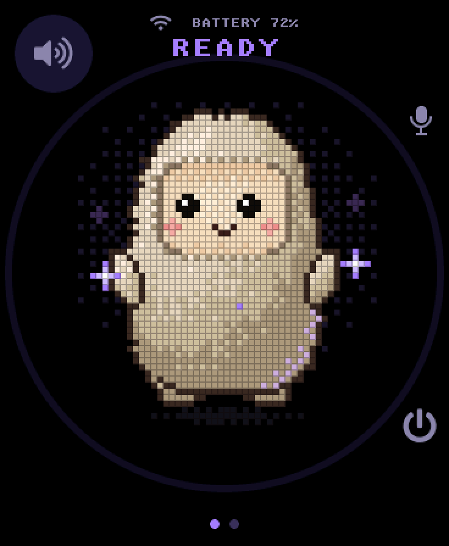
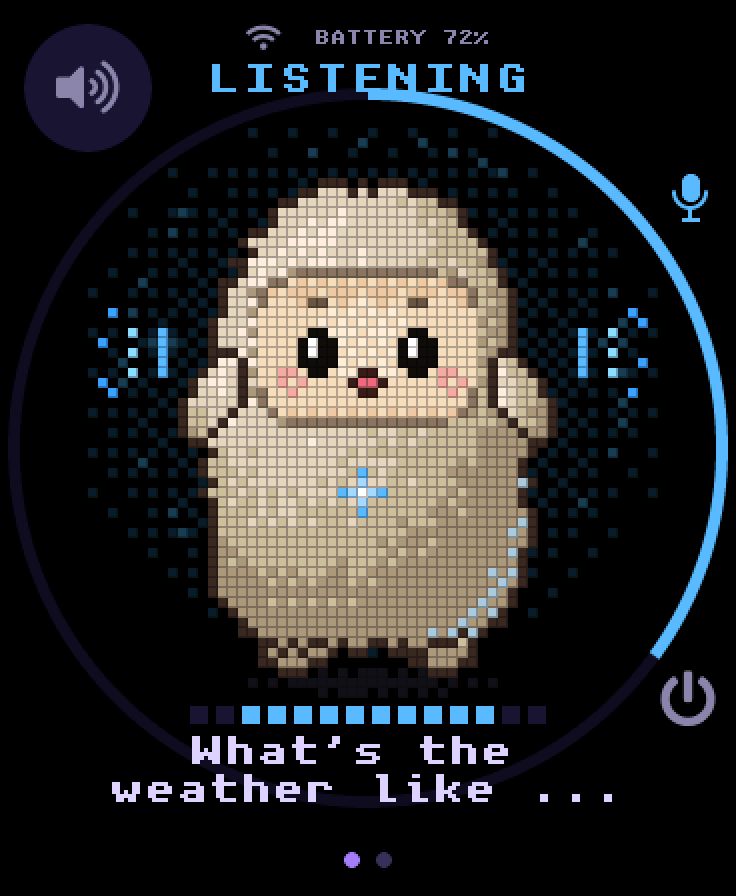
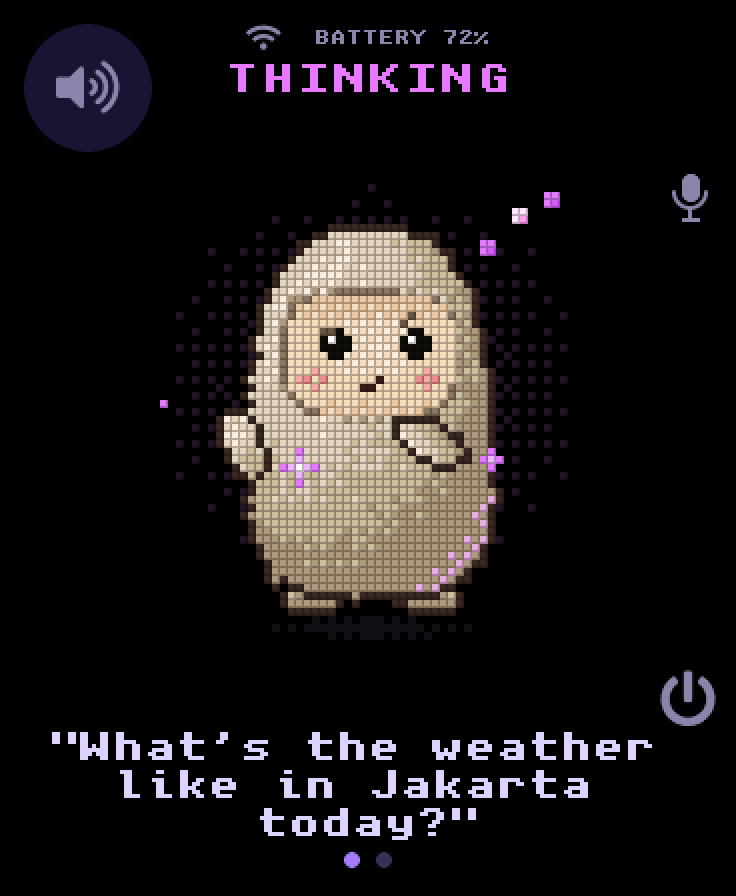
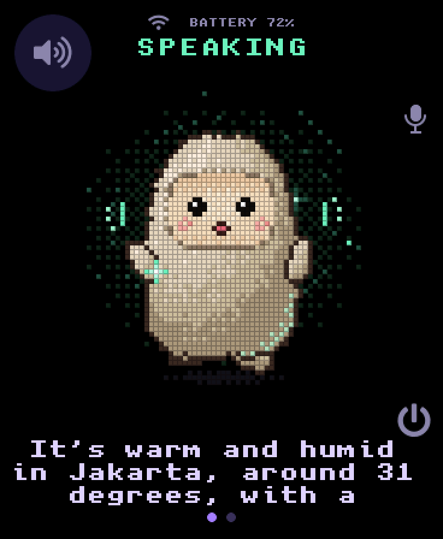
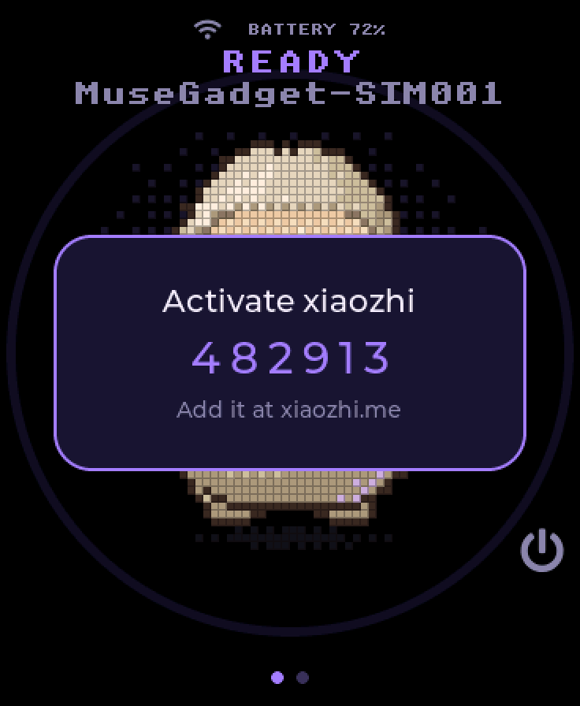
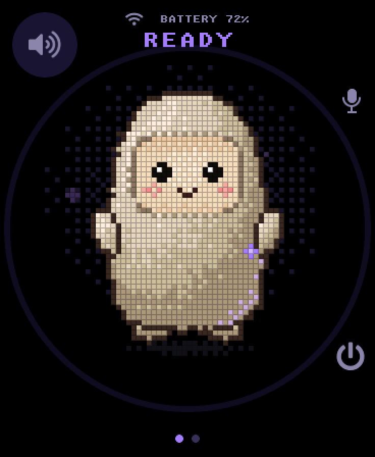

# muse-gadget-xiaozhi

Meta's [Muse Gadget](https://github.com/facebookincubator/muse-gadget-sdk)
firmware, with its pixel character, push-to-talk and touch settings, rewired to
talk to the [xiaozhi.me](https://xiaozhi.me) voice AI
([78/xiaozhi-esp32](https://github.com/78/xiaozhi-esp32)) instead of Muse.

Hold the button, ask something, let go. xiaozhi hears it, thinks, and answers out
loud, with the reply captioned on screen sentence by sentence. You don't need a
Muse account, the Muse app or an SDK token.

<table>
  <tr>
    <td align="center"><br><sub>Idle</sub></td>
    <td align="center"><br><sub>Listening</sub></td>
    <td align="center"><br><sub>Thinking</sub></td>
  </tr>
  <tr>
    <td align="center"><br><sub>Speaking</sub></td>
    <td align="center"><br><sub>First run: activation code</sub></td>
    <td align="center"><br><sub>Tap to pet</sub></td>
  </tr>
</table>

<sub>Screenshots of the Waveshare ESP32-S3-Touch-AMOLED-1.8 layout, rendered by
the firmware's own UI code in the desktop simulator, with sample captions
(`docs/screenshots/*.txt`).</sub>

## What changed from Muse

Only the backend. Muse's UI already sends every voice turn through one small
interface (`muse_hatch_*` in `components/muse/muse_chat.h`). This fork adds a
third implementation of it,
[`muse_chat_xiaozhi.c`](esp32/components/muse/muse_chat_xiaozhi.c), and leaves
the avatar, screens, menus, captions and button handling as they were.

| | Muse (upstream) | This fork |
|---|---|---|
| Account | Muse app pairing + SDK token | 6-digit code at xiaozhi.me |
| Session | HTTP over Noise to a Muse VM | xiaozhi WebSocket protocol |
| Your speech | 24 kHz PCM / WAV | Opus, 16 kHz, 60 ms frames |
| Replies | MP3 | Opus, decoded straight to 16 kHz |
| Character, voice, language | Muse | Set per device in the xiaozhi.me console |

How a turn runs:

1. **Session config.** Once Wi-Fi is up, the device `POST`s to xiaozhi's OTA
   endpoint (`https://api.tenclass.net/xiaozhi/ota/`). The reply carries either
   a WebSocket URL and token, or an activation code if the device isn't bound
   to an account yet.
2. **Press.** It opens the WebSocket, exchanges `hello`, sends
   `listen start` (manual mode) and streams your speech as Opus.
3. **Release.** It sends `listen stop`. The server answers with `stt` (what it
   heard), `tts sentence_start` (each sentence of the reply) and the reply
   audio, then `tts stop`.
4. Captions follow the audio. Text and audio frames share one ordered queue,
   so each sentence is stamped with where its speech starts.

## Hardware

Tested on the **Waveshare
[ESP32-S3-Touch-AMOLED-1.8](https://www.waveshare.com/esp32-s3-touch-amoled-1.8.htm)**,
board revision 2 (CO5300 screen, CST816S touch). This fork adds that board to
the SDK. The board package also detects revision 1 (FT5x06 touch), but that
hasn't been tried.

The xiaozhi backend builds for every Muse full-UI board with PSRAM. Only the
S3-AMOLED-1.8 has been tried:

| Board | `board.sh` name |
|---|---|
| Waveshare ESP32-S3-Touch-AMOLED-1.8 | `s318` (tested) |
| Waveshare ESP32-S3-Touch-AMOLED-1.75C | `s3` |
| AIPI Lite | `aipi` |
| Seeed SenseCAP Watcher | `watcher` |
| M5Stack StickS3 | `sticks3` |

Boards without PSRAM (the C6 AMOLED 1.8, the StickC Plus2) still build, but
with Muse's text-only backend, since the Opus session needs PSRAM.

## Build and flash

You need ESP-IDF 6.0 (6.0.1 or 6.0.2) and a USB data cable.

```sh
git clone -b v6.0.2 --recursive https://github.com/espressif/esp-idf.git ~/esp/esp-idf
~/esp/esp-idf/install.sh esp32s3
. ~/esp/esp-idf/export.sh

git clone https://github.com/moerdowo/muse-gadget-xiaozhi
cd muse-gadget-xiaozhi/esp32
tools/muse/board.sh build s318
tools/muse/board.sh flash s318
```

The first build downloads Meta's Jollybot avatar (see [Licence](#licence)).
To flash a different board, swap `s318` for its name in the table above.

## First run

1. **Wi-Fi.** Swipe left from the character to open Settings → Wi-Fi. Tap
   "Scan for networks", pick yours and type the password on the screen.
2. **Activate.** The screen shows a 6-digit code. Sign in at
   [xiaozhi.me](https://xiaozhi.me), add a device with that code, and pick its
   character, voice and language there. The code disappears once the device is
   bound.
3. **Talk.** Hold **BOOT**, speak, let go. Tap the character to pet it.
   **PWR** is the power and menu button.

Settings → Xiaozhi shows the connection state and lets you test it.

### Your own server

Point the device at a self-hosted
[xiaozhi-esp32-server](https://github.com/xinnan-tech/xiaozhi-esp32-server) in
either of two ways:

- set its OTA URL in Settings → Xiaozhi → Server, or
- set it at build time with `CONFIG_MUSE_XIAOZHI_OTA_URL` (`idf.py menuconfig` →
  Muse).

`CONFIG_MUSE_XIAOZHI_LANGUAGE` sets the language tag the device reports
(default `en-US`).

## Not supported (yet)

- **Wake word:** it's push-to-talk only, as in Muse.
- **MCP device tools:** the device answers xiaozhi's MCP handshake with an
  empty tool list.
- **Expressions:** xiaozhi's `llm` emotion hints are ignored, and the
  character keeps Muse's own moods.
- **Typed chat:** the serial console's `>chat=` doesn't work, because
  xiaozhi's session takes speech only.
- **Firmware updates:** over-the-air updates are off. Muse's Home Link still
  runs (Wi-Fi, Bluetooth setup), but nothing talks to Meta's servers.

## UI simulator

The desktop simulator compiles the real `muse_ui.c` and avatar. Build it for
this board and regenerate the screenshots:

```sh
cmake -S esp32/simulator -B esp32/simulator/build-s318 -G Ninja -DMUSE_SIM_WAVESHARE_S3_18=ON
cmake --build esp32/simulator/build-s318
cd docs/screenshots
../../esp32/simulator/build-s318/muse_simulator --headless --scenario speaking.txt --screenshot speaking.ppm
```

The rest of the SDK's tooling (bench keys, `snap.py`, custom avatars) is
described in [`esp32/README.md`](esp32/README.md) and
[`esp32/AGENTS.md`](esp32/AGENTS.md). The parts about the Muse app and SDK
tokens don't apply here.

## Licence

- **MIT** ([LICENSE](LICENSE)) for the code written for this fork.
- **Apache-2.0** ([LICENSE-APACHE](LICENSE-APACHE)) for everything from Meta's
  Muse Gadget SDK. Those files keep Meta's headers.
- **Third-party** files keep their own licences: minimp3 is CC0, the pixel
  font is BSD-2-Clause.
- **The Jollybot avatar is not in this repository.** It belongs to Meta and
  isn't licensed for redistribution, so
  [`fetch_avatar.cmake`](esp32/cmake/fetch_avatar.cmake) downloads it from
  Meta's repository at build time, from a pinned commit with SHA-256 checks.
  You can also replace it with your own character (`esp32/tools/muse/AVATAR_RECIPE.md`).

[NOTICE](NOTICE) has the full breakdown, including every upstream file this
fork changed.

Not affiliated with or endorsed by Meta or the xiaozhi project. Credit for the
UI goes to the Muse Gadget SDK authors, and for the voice service and protocol
to [78/xiaozhi-esp32](https://github.com/78/xiaozhi-esp32).
